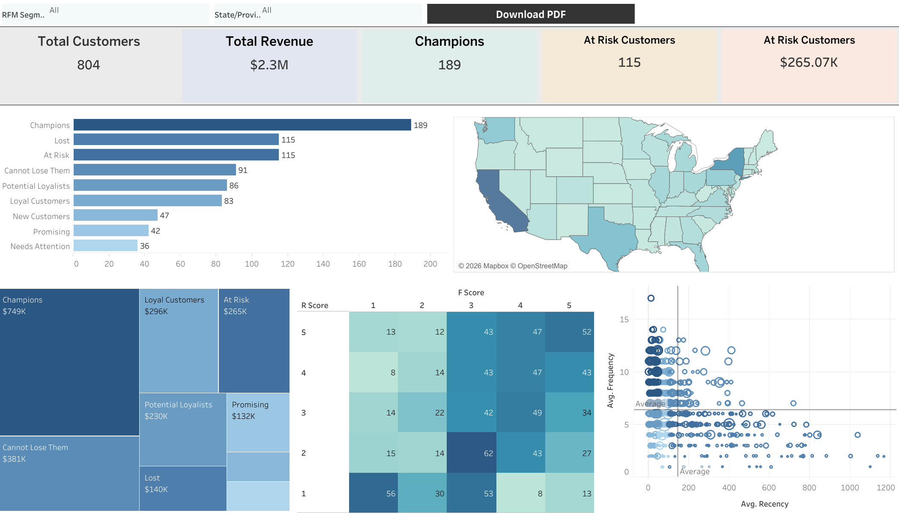
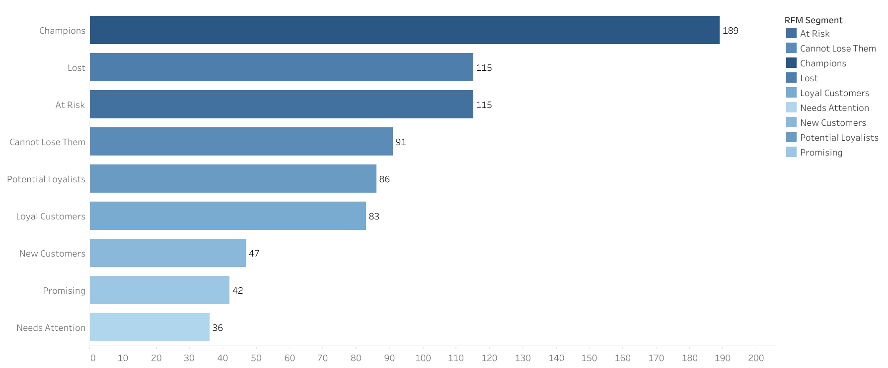
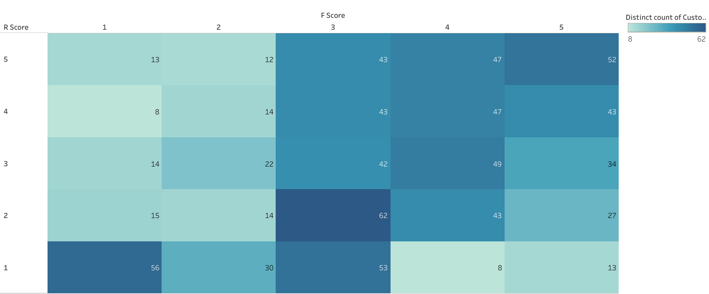
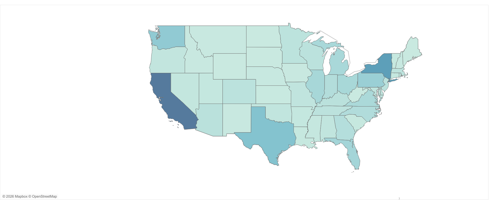

# RFM Customer Segmentation Dashboard

An interactive Tableau dashboard for customer segmentation using Recency, Frequency, and Monetary analysis.

This project identifies high-value customers, loyal customers, customers at risk, and other behavioral segments to support data-driven marketing and customer retention strategies.

## Project Overview

RFM analysis is a customer segmentation technique based on three behavioral dimensions:

- **Recency:** How recently a customer made a purchase
- **Frequency:** How often a customer purchases
- **Monetary:** How much money a customer has spent

Each customer receives a score from 1 to 5 for Recency, Frequency, and Monetary value.

These scores are then used to classify customers into meaningful business segments such as:

- Champions
- Loyal Customers
- Potential Loyalists
- New Customers
- Promising
- Needs Attention
- At Risk
- Cannot Lose Them
- Lost

## Dashboard Preview



## Project Objectives

The main objectives of this project are:

- Calculate customer-level Recency, Frequency, and Monetary values
- Assign R, F, and M scores using percentile-based segmentation
- Group customers into meaningful behavioral segments
- Identify valuable and at-risk customers
- Analyze revenue contribution by customer segment
- Visualize customer behavior using an interactive Tableau dashboard
- Support customer retention and marketing decisions

## Key Features

- Interactive Tableau dashboard
- Customer-level RFM analysis
- Percentile-based RFM scoring
- Customer behavioral segmentation
- Revenue analysis by segment
- Recency and Frequency heatmap
- Customer segment comparison
- Geographic sales analysis
- KPI cards for important customer groups

## Project Structure

```text
rfm-customer-segmentation-dashboard/
│
├── dashboard/
│   └── 7.32.2026925.twbx
│
├── images/
│   ├── dashboard_overview.png
│   ├── customer_segments.png
│   ├── rf_heatmap.png
│   └── sales_map.png
│
├── docs/
│   └── calculated_fields.md
│
├── README.md
└── LICENSE
```

## Tableau Workbook

The complete Tableau workbook is available in:

```text
dashboard/7.32.2026925.twbx
```

To open the workbook:

1. Download the `.twbx` file.
2. Open it using Tableau Public or Tableau Desktop.
3. Explore the dashboard, worksheets, filters, and calculated fields.

## Dashboard Components

### Customer Segment Distribution

This chart shows the number of customers in each RFM segment.

It helps compare the relative size of customer groups and identify the most important segments.



### RF Heatmap

The RF Heatmap displays the relationship between Recency and Frequency scores.

It helps identify customer concentrations across different levels of engagement.



### Geographic Sales Analysis

The sales map presents the geographic distribution of sales across the United States.

It helps identify locations with stronger or weaker sales performance.



## RFM Methodology

### Recency

Recency measures the number of days since a customer's most recent purchase.

A lower Recency value is better because it means the customer purchased more recently.

```tableau
DATEDIFF(
    'day',
    { FIXED [Customer ID] : MAX([Order Date]) },
    [Analysis Date]
)
```

### Frequency

Frequency measures the number of distinct orders placed by each customer.

A higher Frequency value means the customer purchases more often.

```tableau
{ FIXED [Customer ID] : COUNTD([Order ID]) }
```

### Monetary

Monetary measures the total amount of sales generated by each customer.

A higher Monetary value means the customer has contributed more revenue.

```tableau
{ FIXED [Customer ID] : SUM([Sales]) }
```

## RFM Scoring

Each customer receives a score from 1 to 5 for the three RFM dimensions.

### Recency Score

Customers with lower Recency values receive higher scores.

```text
5 = Very recent customer
4 = Recent customer
3 = Average recency
2 = Inactive customer
1 = Long-inactive customer
```

### Frequency Score

Customers with higher purchase frequency receive higher scores.

```text
5 = Very frequent customer
4 = Frequent customer
3 = Average frequency
2 = Low frequency
1 = Very low frequency
```

### Monetary Score

Customers with higher total spending receive higher scores.

```text
5 = Very high spending
4 = High spending
3 = Average spending
2 = Low spending
1 = Very low spending
```

## Customer Segments

| Segment | Description |
|---|---|
| Champions | Recent and frequent customers with strong engagement |
| Loyal Customers | Customers who purchase regularly |
| Potential Loyalists | Recent customers with moderate purchase frequency |
| New Customers | Recently acquired customers with limited purchase history |
| Promising | Customers showing potential for stronger engagement |
| Needs Attention | Customers whose engagement may be declining |
| At Risk | Previously active customers who may become inactive |
| Cannot Lose Them | Valuable customers who have not purchased recently |
| Lost | Customers with very low recent activity and frequency |

## Main KPIs

The dashboard includes or supports the following KPIs:

- Total customers
- Champion customers
- At-risk customers
- At-risk revenue
- Champion revenue
- Customer count by segment
- Revenue by segment
- Average customer revenue
- Average order value
- Geographic sales performance

## Calculated Fields

Detailed Tableau calculated fields are documented in:

```text
docs/calculated_fields.md
```

This document includes:

- Analysis Date
- Recency
- Frequency
- Monetary
- R Score
- F Score
- M Score
- RFM Score
- Total RFM Score
- RFM Segment
- Customer KPIs
- Tableau visualization configurations

## Tools and Technologies

- Tableau Public
- RFM Analysis
- Level of Detail Expressions
- Percentile-based segmentation
- Data visualization
- Customer analytics
- Business intelligence

## Business Applications

The dashboard can support several business decisions:

- Retaining valuable customers
- Designing loyalty campaigns
- Reactivating inactive customers
- Targeting at-risk customers
- Personalizing marketing strategies
- Prioritizing high-value customer segments
- Comparing customer revenue contribution
- Monitoring customer engagement

## Current Limitations

The current dashboard is based on historical transaction data and does not include predictive modeling.

The segmentation rules are based on percentile thresholds and may require adjustment for different industries or customer populations.

The dashboard also does not currently include:

- Customer lifetime value prediction
- Churn prediction
- Campaign response tracking
- Real-time data updates
- Automated customer recommendations

## Future Improvements

Future development may include:

- Adding customer lifetime value analysis
- Adding churn prediction
- Adding cohort analysis
- Adding time-based RFM trends
- Adding customer retention metrics
- Adding marketing campaign recommendations
- Connecting Tableau to a live database
- Adding automated data refresh
- Comparing different segmentation methods

## Author

**Ali Behroozi**

Transportation Engineer and Data Science Researcher with interests in:

- Data analytics
- Business intelligence
- Customer analytics
- Tableau dashboard development
- Machine learning
- Transportation data science

## License

This project is available under the MIT License. See the `LICENSE` file for more information.
